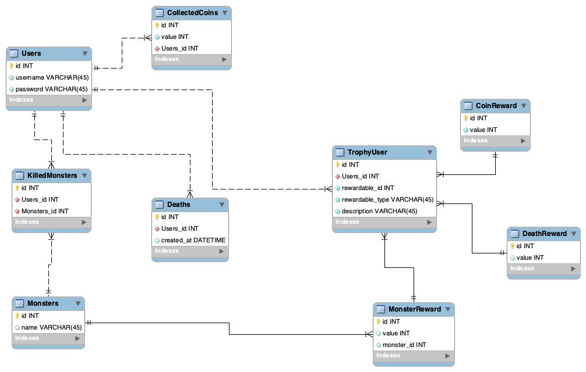
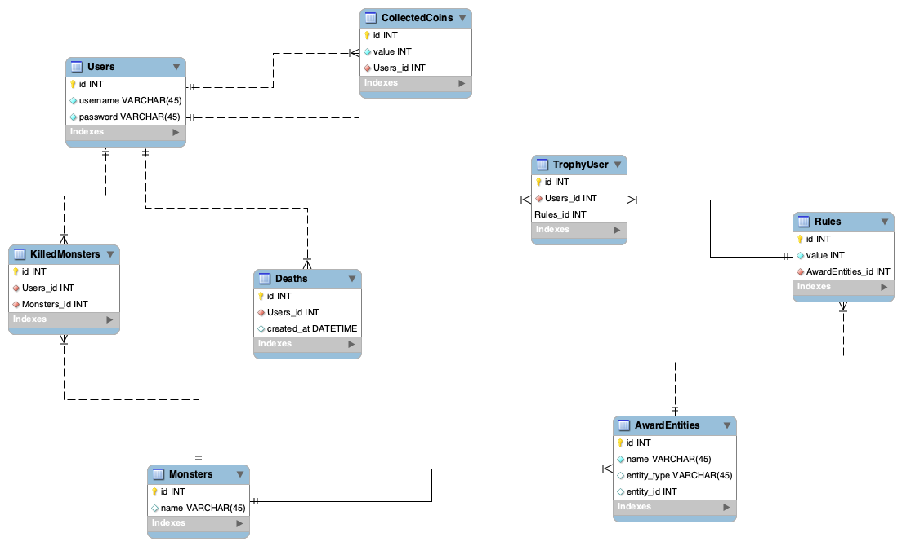
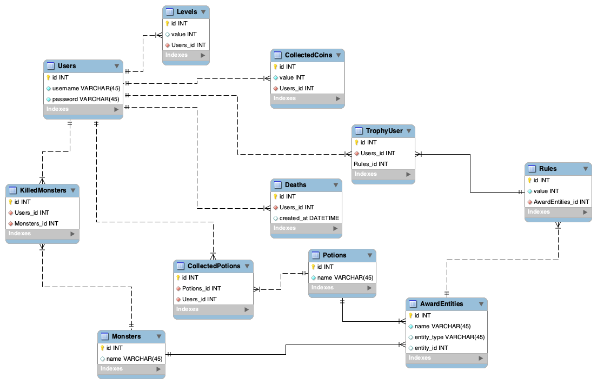
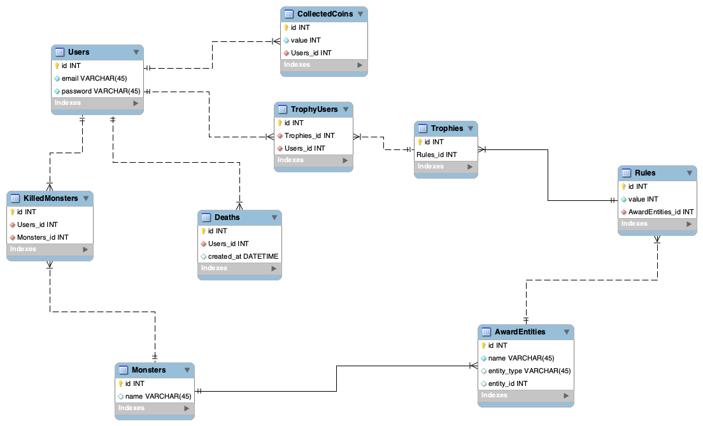
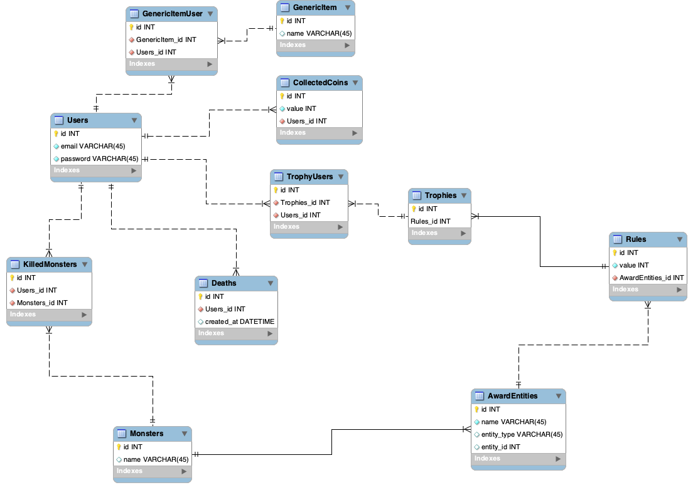
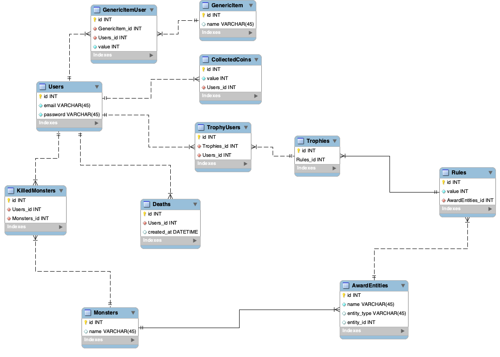

Este projeto é um gerenciador de troféus.

Um usuário ganha troféus ao atingir certas metas, como coletar uma quantidade de moedas,
matar um quantidade de monstros específicos ou morrer uma quantidade de vezes.

A api foi desenvolvida usando Ruby on Rails, usando testes com RSpec e o Rubocop como linter de código.

Existe rota para web onde por meio de um painel de administrador conseguimos fazer cadastros e criando metas, monstros, coletar moedas e etc.

Existe também endpoints para consumir em aplicações separadas, no caso foi desenvolvido um app usando React Native.

# Rodando o projeto
- Clone o repositório
- Rode o comando "bundle install"
- Rode o comando "rspec" para rodar os testes
- Rode o comando "rails s" para iniciar o servidor
- Vá para rota "http://localhost:3000/admin" para acessar o painel de administrador

Painel web: http://trophy-reward.herokuapp.com/admin/

Repositório do aplicativo: https://github.com/diogoqds/trophy_manager_app

# Modelagem dos dados

Para esta aplicação temos tabelas bases que são: Users, CollectedCoins, Monsters, Deaths e KilledMonster.

## v1

Numa primeira versão para as tabelas de moedas, mortes e monstros foi criada uma tabela de objetivos, no caso quando um usuário coletar uma moeda iria verificar na tabela CoinReward se ele atingiu uma das metas estabelecidas lá, caso sim então o usuário ganha um troféu, a mesma coisa acontece quando ele for morto, ou matar um monstro, teria que buscar nas tabelas de DeathReward e MonsterReward.

### **Problemas**
Essa é uma solução simples e que resolve, mas o problema é que se o meu jogo tiver outras entidades que deem troféu, seria necessário criar a tabela dessa própria entidade e a de objetivos dela (Reward), então se chegar ao ponto de adicionar 50 novas entidades teria que adicionar 100 novas tabelas.

## v2

Pensando no problema apresentado na v1, foi feita a v2, para isso criando duas novas tabelas: AwardEntity e Rules.

**AwardEntity**: É um tabela que possui um nome e um relacionamento polimórfico opcional chamado entity. 
Nessa tabela criamos quais as entidades do nosso jogo que podem dar troféu, para isso usamos o campo nome e damos o nome do nosso model, e no caso de houver uma diferenciação da entidade, como por exemplo o monstro, que pode ser um Bowser ou Turtle, ai usamos o campo polimórfico entity.

**Rules**: É a tabela que possui o valor a ser alcançado e qual a AwardEntity.
Um Trophy possui uma Rule.

### **Problemas**
Essa é uma solução mais genérica e que consegue resolver o problema proposto e caso a aplicação tenha mais entidades que possam dar troféus vai ser necessário apenas incluir essas novas entidades e criar regras para elas, como em um dos casos pensado abaixo, que foi adicionado a tabela de Levels e de poções coletadas (Ex: Coletar poção de cura ou de mana)

O problema dessa solução seria a tabela de AwardEntity que precisa ter o nome igual ao do model.

## v4

Adicionado uma relacionamento n pra n entre usuários e troféus.

## v5

Adicionado tabela GenericItem e um relacionamento n pra n entre Users e GenericItem,
com isso é possível criar outros items dentro do jogo como Poções ou Espadas e adicionar regras para se ganhar troféu.

## v6

Adicionado o campo value a tabela GenericItemUsers, para não ter que fazer 100 requisições caso eu queira por exemplo coletar 100 de XP, ou 200 espadas.